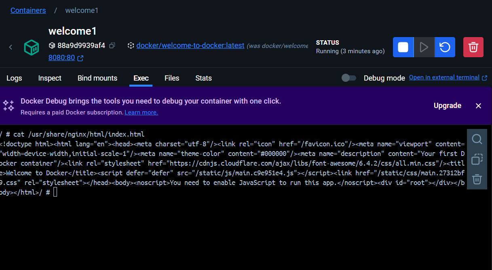

# Run Existing Docker Image as a COntainer

### Run Container baru dengan nama "welcome1"
Berikut adalah hasil run container di terminal

### Membuka Localhost:8080 di Browser
Berikut adalah hasil ketika run container berhasil dan mencoba untuk mengakses browser

### Logs di Welcome1
Berikut adalah hasil Log dari Welcome1

### Execute Command 'cat /usr/share/nginx/html/index.html'
Berikut Screenshot dari hasil execute

### Stop Container
Berikut adalah hasil Log ketika container di hentikan

