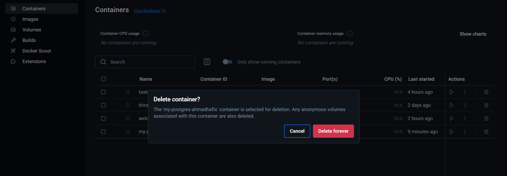

# Container, Env, & Volume

### Create new container with env and Volume
---------------------------------------------------------------------------
Run the following command to create a new container with env and a volume:
*docker run -d --name my-postgres-v2-ahmadhafis \
(name-of-container) \
-e POSTGRES_USER=postgres -e POSTGRES_PASSWORD=password \
(username & password for postgredb) \
-v my-pg-volume-ahmadhafis:/var/lib/postgresql/data \
(name of volume and where env will be mounted) \
-p 5434:5432 postgres (port local:docker)*

Result

### Check the Postgres in DBeaver
result

Add new table and insert 10 records

### Delete the Container and Create new container
stop and Delete the container

Create new container with name *my-postgres-v2-ahmadhafis* with the sam env and volume

### See if the table still exist

