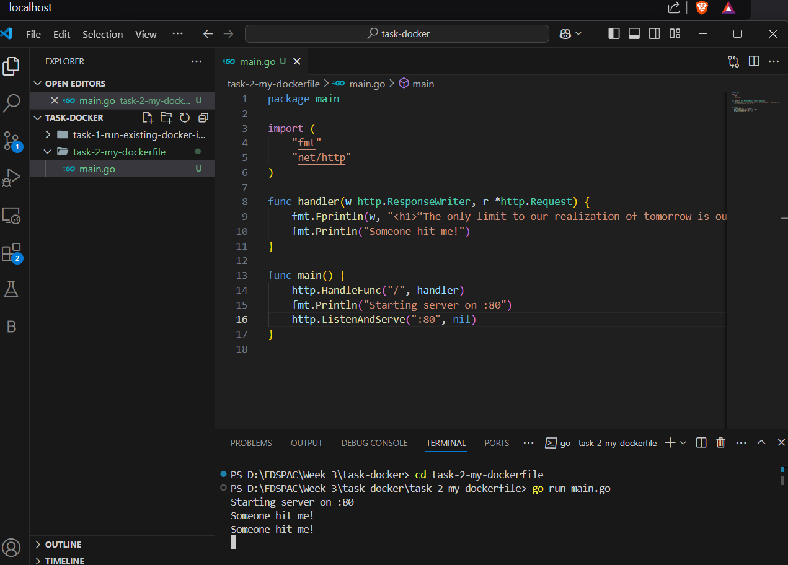
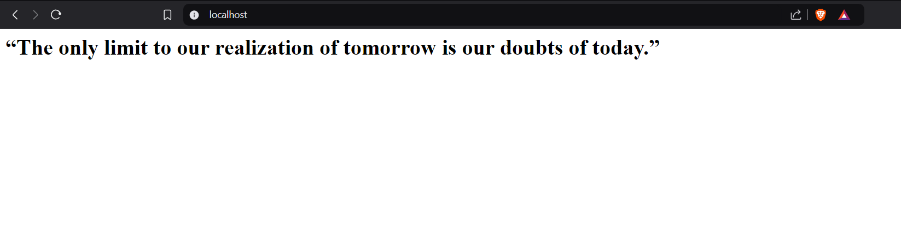
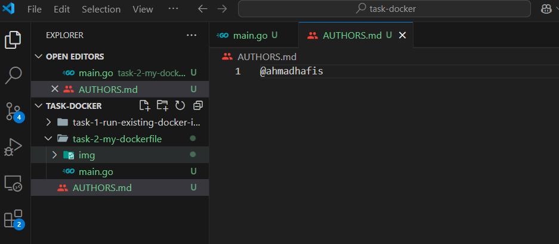
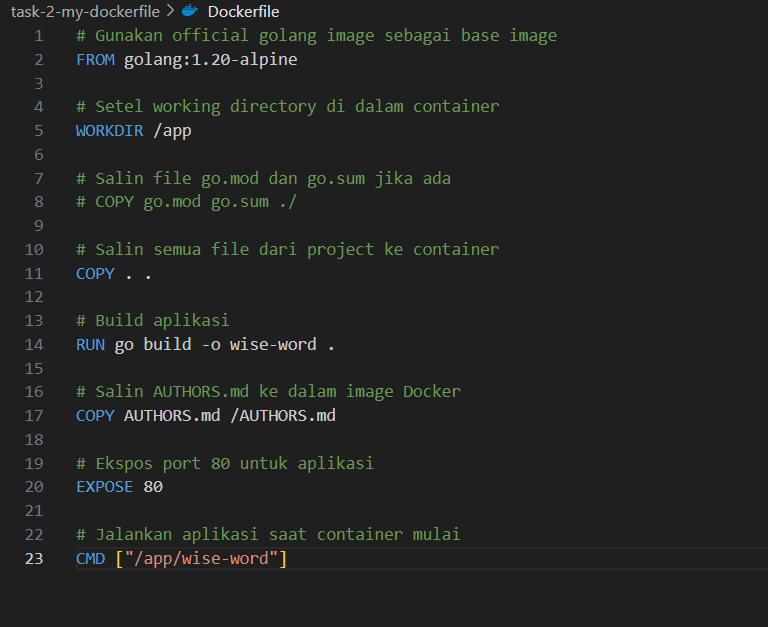
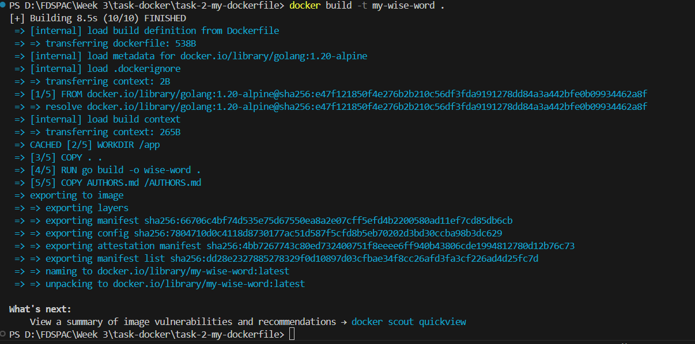
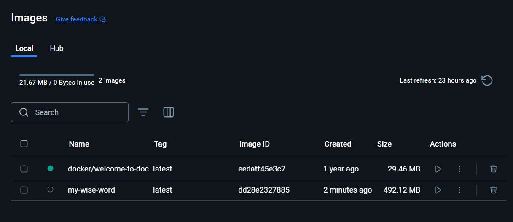
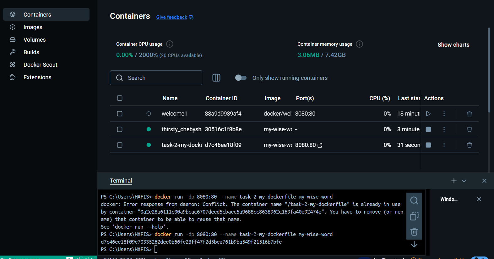
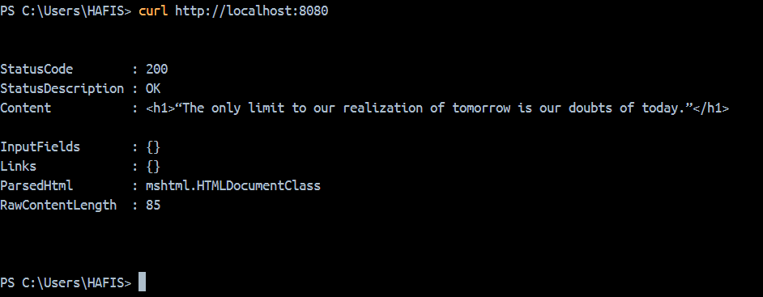
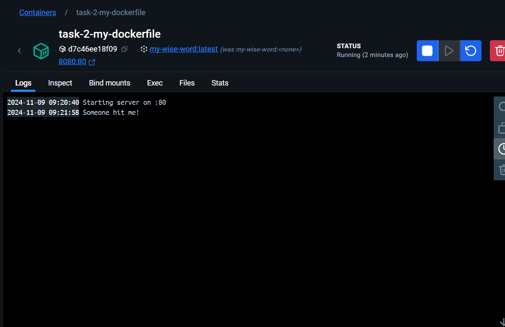

# Build Dockerfile ke Docker Image

### Create Golang Project
---------------------------------------------------------------------------

When run the Go project, open the browser. This will show in the browser

### Add AUTHORS.md
Create AUTHORS.md. the following file will copy to docker image

### Build the Dockerfile
The Dockerfile is created to build the Docker image

### Build Docker Image
execute it using : docker build -t my-wise-word

### Show in the Image
When open in images in docker desktop, this will show up

### Run New Container
using command : docker run -dp 8080:80 task-2-my-dockerfile my-wise-word 

### See The Logs
This is the logs when already run the container and exposed the app

